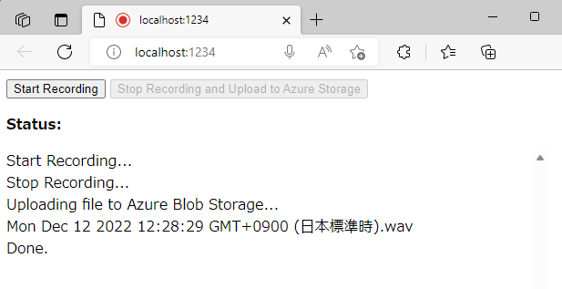
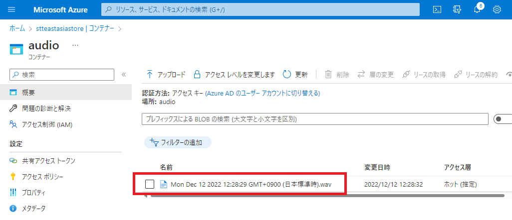

# ブラウザで録音した音声をクラウドにアップロードする

## 概要
　本サンプルは「[ブラウザーで JavaScript v12 SDK を使用して BLOB を管理する](https://learn.microsoft.com/ja-jp/azure/storage/blobs/quickstart-blobs-javascript-browser)」のチュートリアルを元に作成されています。基本的に開発環境の準備などはチュートリアルの手順と一緒となりますが、ストレージ操作はファイルのアップロードだけなので **CORS 設定は PUT と POST のみ許可**すれば大丈夫です。

## 動作イメージ
(1) **Start Recording** ボタンを押してマイクからの録音を開始します。<p>
<p>
(2) **Stop Recording and Update to Azure Storage** ボタンを押すと録音を停止し、メモリ中の録音データを Azure Blob ストレージの audio コンテナにアップロードします。<p>
<p>

## 初期設定
　index.js ファイルの先頭で SAS URL を指定します。アップロードだけなので WRITE アクセスだけを許可すれば大丈夫です。audio コンテナは予め用意しておく必要があります。
```javascript:index.js
// Update <placeholder> with your Blob service SAS URL
const blobSasUrl = "<placeholder>";
const containerName = "audio";
```
※ 本来、静的コンテンツに SAS URL を埋め込むことは推奨されませんので、本格的に実装される場合には、10分間だけ WRITE アクセスを許可する SAS URL を返す WEB API 等を用意いただき、アップロード毎に毎回異なる SAS URL を動的生成して利用する事をお勧めします。

## パッケージのインストールとローカル実行
Visual Studio Code のターミナルで、以下を実行します。
```bash:build.sh
npm install @azure/storage-blob
npm install parcel
npm start
```

## ホストへの配置
　npm start コマンドで dist フォルダに出力される index.html と index.xxxxxx.js 2つの静的コンテンツを任意の WEB サーバーに配置すれば動作します。より最適化されたビルドは npm run build で build フォルダに出力されるコンテンツとなります。

　[Azure Storage 自体が静的 Web サイトをホストする機能](https://learn.microsoft.com/ja-jp/azure/storage/blobs/storage-blob-static-website-how-to)をもっているので、こちらに配置するのが一番簡単かと思われます。
